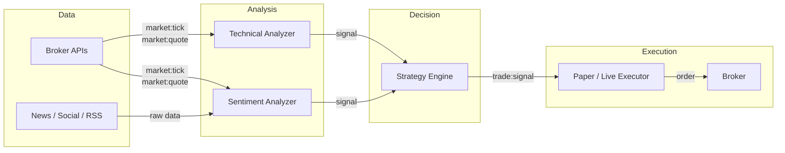
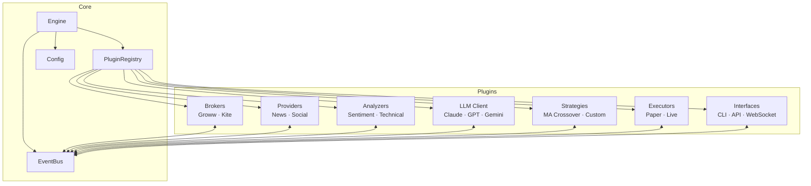
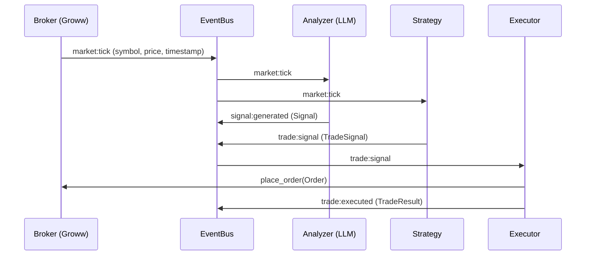
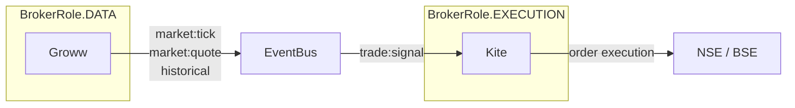
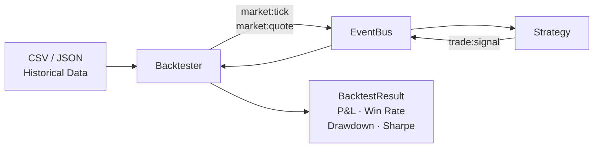
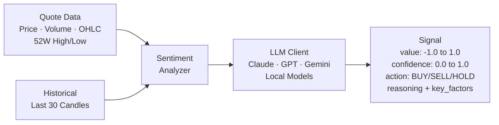

# sudo-trade

> trades need sudo privileges

AI-powered algorithmic trading system for Indian markets. Combines live market data from Indian broker APIs, LLM-driven sentiment analysis, and automated trade execution — all through a plugin architecture where every layer is independently swappable.

Paper trading first. Real money when it's ready.

## How It Works



Every arrow is an **event on the EventBus**. Plugins never import each other — the Engine wires them together. A strategy that runs on live Groww ticks works identically on backtester replay without changing a single line.

## Architecture



**Everything is a plugin.** The core is just an event bus and a registry. Every plugin implements a `Protocol` with `name`, `start()`, `stop()`. Register them with the engine:

```python
engine = Engine(config)
engine.add("broker", GrowwBroker(events, config, role=BrokerRole.DATA))
engine.add("broker", KiteBroker(events, config, role=BrokerRole.EXECUTION))
engine.add("analyzer", SentimentAnalyzer(llm, events))
engine.add("strategy", MovingAverageCrossover(events))
await engine.run()
```

Multiple plugins per category. Multiple brokers simultaneously. The engine starts them in registration order, stops them in reverse.

## Event Flow

The EventBus is the contract. Plugins communicate exclusively through events:



**Standardized events:**

| Event | Payload | Emitted By |
|---|---|---|
| `market:tick` | symbol, price, timestamp | Broker, Backtester |
| `market:quote` | symbol, price, volume, ohlc, exchange | Broker, Backtester |
| `market:historical` | symbol, interval, candles | Broker |
| `signal:generated` | Signal object | Analyzers |
| `trade:signal` | TradeSignal object | Strategies |
| `trade:executed` | TradeResult object | Executors |
| `portfolio:holdings` | holdings list | Broker |
| `portfolio:positions` | positions list | Broker |
| `backtest:completed` | BacktestResult | Backtester |

## Multi-Broker Design

Brokers have roles via `BrokerRole` flag:



- **DATA** — market quotes, historical candles, WebSocket streaming
- **EXECUTION** — order placement and management
- **BOTH** — everything

Run Groww for cheap data and Kite for execution. Or use one broker for both. The strategy doesn't know or care.

## Backtesting

The backtester replays historical data through the same EventBus. Strategies are 100% agnostic:



The backtester controls time — strategies read `timestamp` from event kwargs, never from `datetime.now()`. Same strategy class, same events, same code path. Live or backtest.

```
  ══════════════════════════════════════════════════
  Backtest Report: ma_crossover
  ══════════════════════════════════════════════════
  Period:       2024-04-01 → 2025-03-07
  Initial:      ₹1,00,000
  Final:        ₹1,03,420
  Total P&L:    ₹3,420 (+3.4%)
  Trades:       12 (Win: 7, Loss: 5)
  Win Rate:     58.3%
  Max Drawdown: 4.2%
  Sharpe Ratio: 1.14
  ══════════════════════════════════════════════════
```

## LLM Sentiment Analysis

Feed market data to any LLM, get structured trading signals back:



The LLM client speaks OpenAI-compatible schema via raw `aiohttp` — works with Claude, GPT, Gemini, local models, anything behind an OpenAI-compatible endpoint. No `openai` SDK dependency.

## Project Structure

```
sudo-trade/
├── src/
│   ├── core/               # Engine, EventBus, PluginRegistry, Config, Logger
│   ├── brokers/            # Broker plugins + instrument map + rate limiter
│   │   ├── groww.py        # Groww: REST + WebSocket, TOTP auth, rate-limited
│   │   ├── kite.py         # Kite Connect (stub)
│   │   ├── instruments.py  # Instrument CSV cache + symbol resolution
│   │   └── rate_limiter.py # Token-bucket per-second + per-minute limits
│   ├── analysis/           # Analyzers (sentiment, technical)
│   │   └── sentiment.py    # LLM-powered market sentiment analyzer
│   ├── llm/                # LLM client (OpenAI-compatible, any provider)
│   ├── strategy/           # Strategy plugins (signals in, trade decisions out)
│   ├── execution/          # Executors (paper, live)
│   ├── providers/          # Data sources (news, social, RSS)
│   ├── interfaces/         # UI plugins (CLI, API, WebSocket)
│   ├── backtesting/        # Backtest engine, data loaders, fill simulator
│   │   ├── engine.py       # EventBus replay — strategies work identically
│   │   ├── data_loader.py  # CSV + JSON loaders
│   │   ├── simulator.py    # Slippage + commission simulation
│   │   └── sample_strategy.py  # MA Crossover (works live + backtest)
│   └── __main__.py         # Entry point
├── scripts/
│   ├── groww_cli.py        # CLI: quote, stream, holdings, positions, historical
│   └── backtest_cli.py     # CLI: run backtests with formatted reports
├── configs/
│   └── default.toml        # Runtime config (mode, brokers, strategy, LLM)
├── data/                   # Runtime data (gitignored except reference/)
│   └── reference/          # Instrument CSV, sample data
├── docs/                   # Broker API specs, strategy notes
├── logs/                   # Structured JSON logs (gitignored)
└── tests/                  # 21 tests — brokers, backtester, events
```

## Setup

```bash
# Clone
git clone https://github.com/myselfshravan/sudo-trade.git
cd sudo-trade

# Install dependencies (Python 3.13+)
uv sync

# Configure credentials
cp .env.example .env
# Edit .env with your API keys
```

### Environment Variables

```bash
# Groww (required for live data)
GROWW_API_KEY=your_api_key
GROWW_API_SECRET=your_secret        # or use TOTP below
GROWW_TOTP_SECRET=your_base32_totp  # from Groww 2FA setup

# LLM (required for sentiment analysis)
AI_BASE_URL=https://api.openai.com/v1  # any OpenAI-compatible endpoint
AI_MODEL=gpt-4                          # model name at that endpoint
OPENAI_API_KEY=your_key                 # or ANTHROPIC_API_KEY

# Engine
SUDO_TRADE_MODE=paper  # paper | live
```

## Usage

### Live Market Data

```bash
# Get a quote
uv run python -m scripts.groww_cli quote RELIANCE

# Batch quotes
uv run python -m scripts.groww_cli quotes RELIANCE INFY TCS

# Stream real-time ticks via WebSocket
uv run python -m scripts.groww_cli stream RELIANCE INFY

# Portfolio
uv run python -m scripts.groww_cli holdings
uv run python -m scripts.groww_cli positions

# Historical candles
uv run python -m scripts.groww_cli historical RELIANCE --interval 1d --days 30
```

### Backtesting

```bash
# Run MA crossover backtest on sample data
uv run python -m scripts.backtest_cli \
  --data data/reference/sample_RELIANCE.csv \
  --strategy ma_crossover \
  --capital 100000

# Custom MA windows
uv run python -m scripts.backtest_cli \
  --data data/reference/sample_RELIANCE.csv \
  --strategy ma_crossover \
  --short 10 --long 30

# Export results as JSON
uv run python -m scripts.backtest_cli \
  --data data/reference/sample_RELIANCE.csv \
  --strategy ma_crossover \
  --output results.json
```

### Run the Engine

```bash
uv run python -m src
```

## Development

```bash
# Run tests
uv run pytest

# Lint
uv run ruff check .

# Format
uv run ruff format .

# Add a dependency
uv add <package>

# Add a dev dependency
uv add --dev <package>
```

## Writing a Strategy

A strategy subscribes to events and emits trade signals. This exact code runs on live data and backtester replay:

```python
class MyStrategy:
    name = "my_strategy"

    def __init__(self, events: EventBus):
        self._events = events

    async def start(self) -> None:
        self._events.on("market:tick", self._on_tick)

    async def stop(self) -> None:
        self._events.off("market:tick", self._on_tick)

    async def _on_tick(self, symbol: str, price: float, timestamp: datetime, **_):
        # Your logic here
        if should_buy:
            signal = TradeSignal(
                action=TradeAction.BUY,
                symbol=symbol,
                quantity=1,
                confidence=0.8,
                reasoning="my reason",
                timestamp=timestamp,  # use event timestamp, not datetime.now()
            )
            await self._events.emit("trade:signal", signal=signal)
```

Register it: `engine.add("strategy", MyStrategy(events))`

## Writing a Broker Plugin

Implement the `Broker` protocol:

```python
class MyBroker:
    name = "my_broker"
    role = BrokerRole.DATA

    async def start(self) -> None: ...
    async def stop(self) -> None: ...
    async def get_quote(self, symbol: str) -> Quote: ...
    async def get_quotes(self, symbols: list[str]) -> list[Quote]: ...
    async def get_historical(self, symbol, interval, from_date, to_date) -> list[dict]: ...
    async def place_order(self, order: Order) -> str: ...
    # ... see src/brokers/base.py for full protocol
```

## Stack

- **Python 3.13** with `uv` for package management
- **asyncio** everywhere — async by default
- **aiohttp** for HTTP (broker REST APIs + LLM calls)
- **growwapi** for Groww broker integration
- **pyotp** for TOTP-based authentication
- **ruff** for linting + formatting
- **pytest + pytest-asyncio** for testing

## License

MIT
